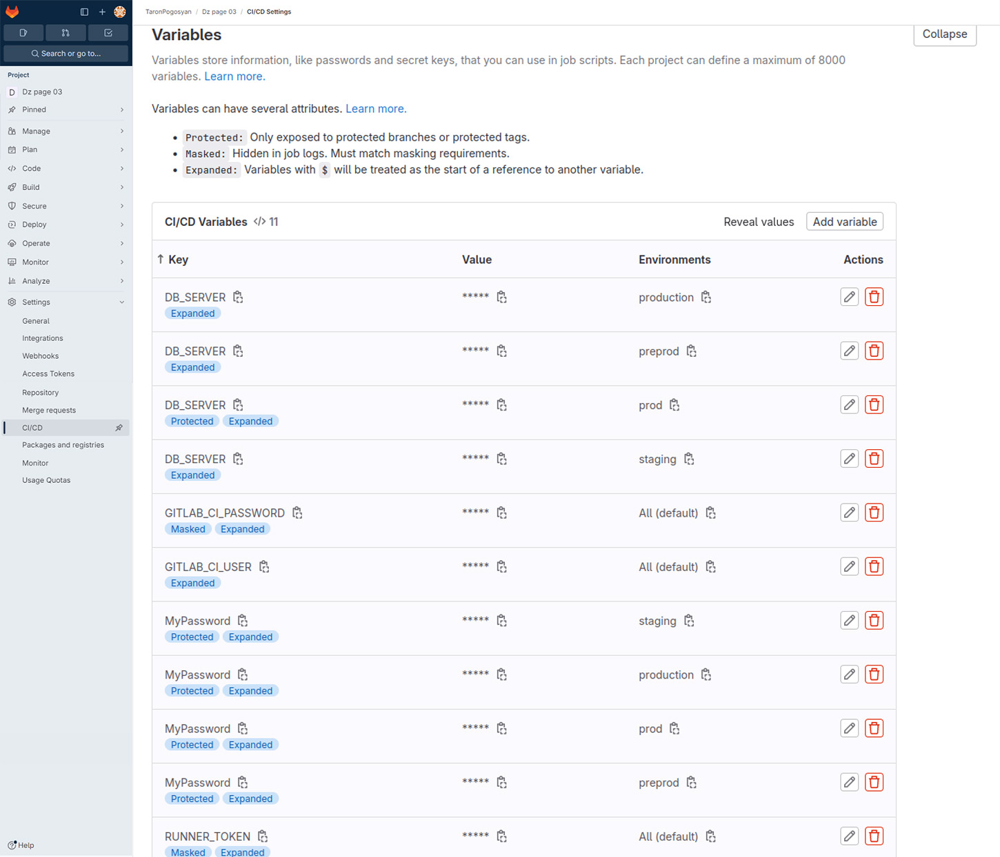
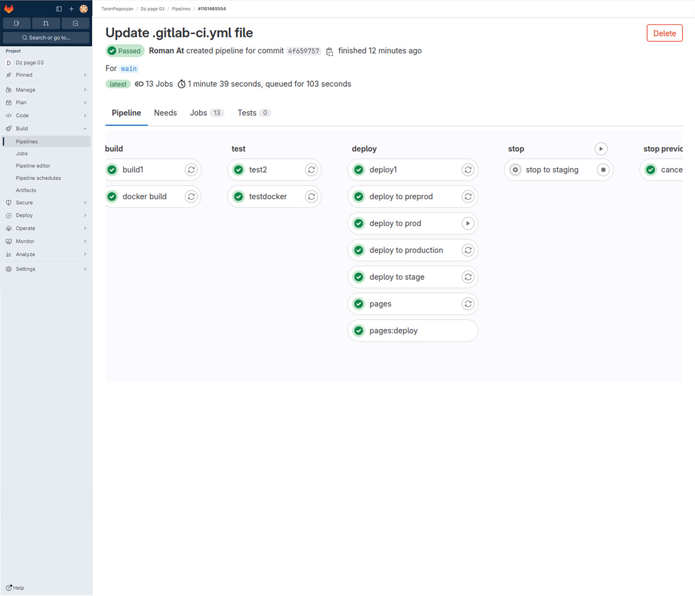
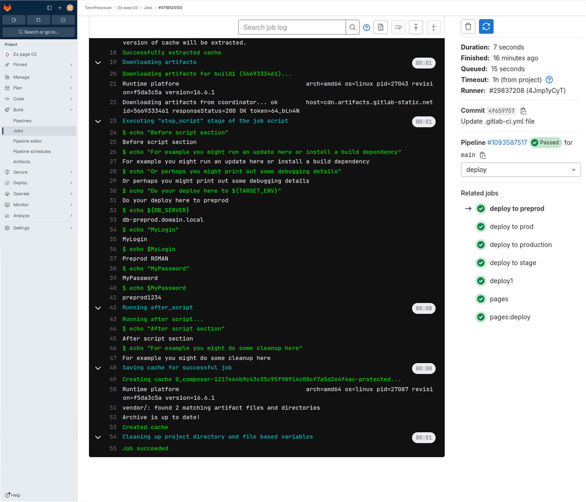
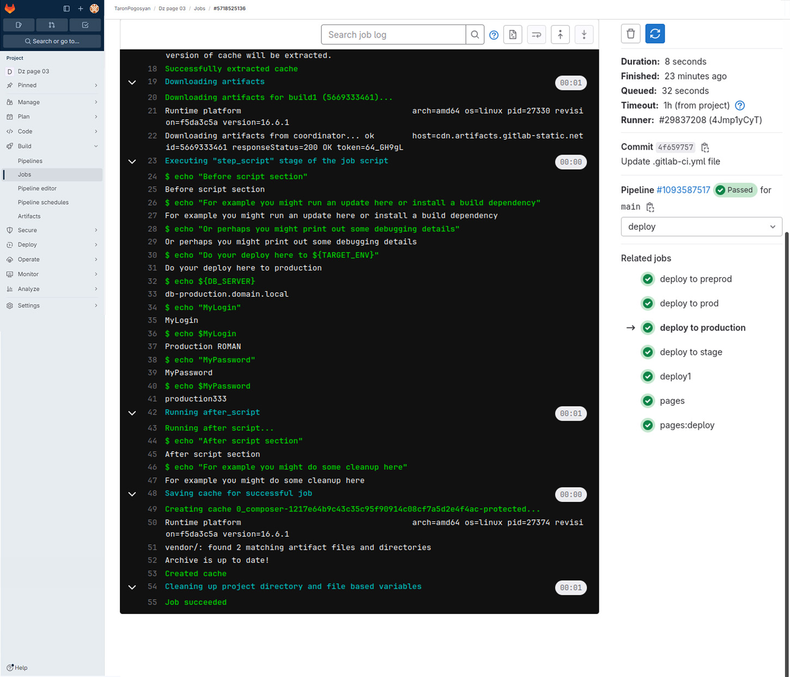

# homeWork-03

# CI/CD. Семинар 03. Continuous delivery и continuous deployment (непрерывная доставка и развертывание)

## Задача

1. Добавить 2 окружения "preprod" и "production"
2. Добавить отдельные deploy job для каждой среды
3. Добавить переменную "$MyLogin" внутри .gitlab-ci.yml, которая будет меняться в зависимости от среды.
4. Добавить переменную "$MyPassword" не используя .gitlab-ci.yml, которая так же будет меняться в зависимости от среды.
5. Добавить скрипт в .gitlab-ci.yml, который найдёт все запущенные pipeline по названии ветки(ref) и остановит их.

## Решение

### Пункты 1, 2, 3, 4

Добавляем окружение `preprod` и `production`. В них используем переменную `$MyLogin` (в настройках она будет иметь разные значения).

```yaml
deploy to preprod:
  stage: deploy
  variables:
    TARGET_ENV: preprod
    MyLogin: "Preprod ROMAN"
  script:
    - echo "Do your deploy here to ${TARGET_ENV}"
    - echo ${DB_SERVER}
    - echo "MyLogin"
    - echo $MyLogin
    - echo "MyPassword"
    - echo $MyPassword
  only:
    - main
  environment:
    name: preprod
```

```yaml
deploy to production:
  stage: deploy
  variables:
    TARGET_ENV: production
    MyLogin: "Production ROMAN"
  script:
    - echo "Do your deploy here to ${TARGET_ENV}"
    - echo ${DB_SERVER}
    - echo "MyLogin"
    - echo $MyLogin
    - echo "MyPassword"
    - echo $MyPassword
  only:
    - main
  environment:
    name: production
```





